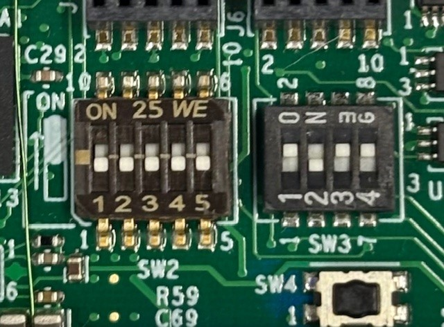

# NXP Mobile Robotics Manifest Repository

This repository contains Yocto manifest files for building Linux images for NXP Mobile Robotics boards:
- **NavQ95** (i.MX95) - Latest generation
- **NavQPlus** (i.MX8M Plus) - Previous generation

The [IMX yocto project users guide](https://www.nxp.com/docs/en/user-guide/UG10164.pdf) contains
detailed explanation on how to build SD card images for the various iMX devices. For the NavQ boards there are a few exceptions that need to be taken care of.

See below table containing items that deviate from the manual:

| Item                   | Original                                    | NavQ95                                            | NavQPlus                                          |
| -----------------------| ------------------------------------------- | ------------------------------------------------- | ------------------------------------------------- |
| imx-manifest repo URL  | https://github.com/nxp-imx/imx-manifest.git | https://github.com/rudislabs/mr-imx-manifest.git  | https://github.com/rudislabs/mr-imx-manifest.git  |
| Manifest file          | imx-6.12.20-2.0.0.xml                       | imx-6.12.20-2.0.0-navq.xml                        | imx-6.12.20-2.0.0-navqplus.xml                    |
| Machine                | * (eg. imx95-19x19-lpddr5-evk)              | imx95-navqadesktop                                | imx8mpnavqdesktop                                 |

---

# NavQ95 (i.MX95)

For a NavQ95 specific explanation refer to the [Build SD card image for NavQ95](#build-sd-card-image-navq95) and the [Flash image to SD card](#flash-image-to-sd-card-navq95) paragraphs on this page.

To interface with Argos see chapter [Interfacing with Argos](argos/README.md).

<a name="build-sd-card-image-navq95"></a>

## Build SD card image for NavQ95

Sync repositories by manifest:
```bash
mkdir imx-yocto-bsp
cd imx-yocto-bsp
repo init -u https://github.com/rudislabs/mr-imx-manifest.git -b lf-6.12.20-2.0.0-walnascar-mr -m imx-6.12.20-2.0.0-navq.xml
repo sync
```

Setup build:
```bash
MACHINE=imx95-navqadesktop DISTRO=imx-desktop-xwayland source imx-setup-release.sh -b build-95-full
```

Optionally add below lines to conf/local.conf in case the host should stay responsive
```bash
BB_NUMBER_THREADS = "6"
PARALLEL_MAKE = "-j 5"
```

Start build:
```bash
bitbake mc:imx95-navqdesktop:imx-image-mr
```
Or to start build and immediately detach the process from the console (may be convenient since this build may take a while)
```bash
nohup bitbake mc:imx95-navqdesktop:imx-image-mr &
```

To build an image with ROS2 preinstalled:
```bash
bitbake mc:imx95-navqdesktop:imx-image-ros
```

<a name="flash-image-to-sd-card-navq95"></a>

## Flash image to SD card (NavQ95)

To flash the yocto image to an SD card use the command below. Make sure you update the output file ```of=/dev/sdX``` to the block device that belong to the SD card.
```bash
cd /path/to/imx-yocto-bsp/build-95-full

# Deploy mc:imx95-navqdesktop:imx-image-mr on /dev/sdX
zstdcat tmp-imx95-navq/deploy/images/imx95-navq/imx-image-mr-imx95-navq.rootfs.wic.zst | sudo dd of=/dev/sdX bs=1M conv=fsync

# Deploy mc:imx95-navqdesktop:imx-image-ros on /dev/sdX
zstdcat tmp-imx95-navq/deploy/images/imx95-navq/imx-image-ros-imx95-navq.rootfs.wic.zst | sudo dd of=/dev/sdX bs=1M conv=fsync
```

<a name="flash-nor-flash-image"></a>

## Flash NOR flash image (NavQ95)

Install pyocd to flash the image through the on-board JTAG device.
This is tested with python 3.10 but python 3.9 should suffice.

Clone pyocd into a directory of your preference and checkout the imx95 branch:
```bash
git clone git@github.com:NXP-Robotics/pyocd-private.git -b imx95
```

Build pyocd:
```bash
cd pyocd-private
python3 -m pip install .
```

Make sure the DIP switches are correctly configured as described in [Power up](#power-up-navq95).
Remove any SD card and connect the Debug USB port (J2) to your host. Then apply 12V to the J15 connector to power up the board. Make sure to do this in the given order.

Run below command to flash the built RTOS software to the NOR flash:
```bash

pyocd flash -t mimx95_cm33 path/to/built/file.bin -f 10m
```

:warning: Writing to NOR flash is not completely stable yet. Retry the pyocd flash command until pyocd displays it had only programmed 0 pages.

<a name="power-up-navq95"></a>

## Power up NavQ95

Before powerering up the NavQ95 make sure the DIP switches have the correct settings. They must be configured like the image below.



Insert the SD card with the image installed. Connect the Debug USB port (J2) to your host. Then apply 12V to the J15 connector to power up the board.

:warning: Currently it is important to connect the USB and power supply in that order. Otherwise the board won't completely power up. This can be fixed in software and will probably happen soon.


The USB port gives access to the tty's of linux and RTOS (if flashed to the NOR flash).

The default linux user is 'user' (password: 'user')

---

# NavQPlus (i.MX8M Plus)

The NavQPlus uses the same manifest repository but with a different manifest file optimized for i.MX8M Plus builds.

<a name="build-sd-card-image-navqplus"></a>

## Build SD card image for NavQPlus

Sync repositories by manifest:
```bash
mkdir imx-yocto-bsp
cd imx-yocto-bsp
repo init -u https://github.com/rudislabs/mr-imx-manifest.git -b lf-6.12.20-2.0.0-walnascar-mr -m imx-6.12.20-2.0.0-navqplus.xml
repo sync
```

Setup build:
```bash
MACHINE=imx8mpnavqdesktop DISTRO=imx-desktop-xwayland source imx-setup-release.sh -b build-8mp
```

Optionally add below lines to conf/local.conf in case the host should stay responsive
```bash
BB_NUMBER_THREADS = "6"
PARALLEL_MAKE = "-j 5"
```

Start build:
```bash
bitbake imx-image-mr
```
Or to start build and immediately detach the process from the console:
```bash
nohup bitbake imx-image-mr &
```

To build an image with ROS2 preinstalled:
```bash
bitbake imx-image-ros
```

<a name="flash-image-to-sd-card-navqplus"></a>

## Flash image to SD card (NavQPlus)

To flash the yocto image to an SD card use the command below. Make sure you update the output file ```of=/dev/sdX``` to the block device that belongs to the SD card.
```bash
cd /path/to/imx-yocto-bsp/build-8mp

# Deploy imx-image-mr on /dev/sdX
zstdcat tmp/deploy/images/imx8mpnavq/imx-image-mr-imx8mpnavq.rootfs.wic.zst | sudo dd of=/dev/sdX bs=1M conv=fsync

# Deploy imx-image-ros on /dev/sdX
zstdcat tmp/deploy/images/imx8mpnavq/imx-image-ros-imx8mpnavq.rootfs.wic.zst | sudo dd of=/dev/sdX bs=1M conv=fsync
```

## Power up NavQPlus

Insert the SD card with the image installed. Connect USB-C for power and debug console access.

The default linux user is 'user' (password: 'user')

---

# Machine Options

## NavQ95 Machines
- `imx95-navqa` - NavQ95 variant A (minimal)
- `imx95-navqadesktop` - NavQ95 variant A with Ubuntu desktop
- `imx95-navqb` - NavQ95 variant B (minimal)
- `imx95-navqbdesktop` - NavQ95 variant B with Ubuntu desktop

## NavQPlus Machines
- `imx8mpnavq` - NavQPlus (minimal)
- `imx8mpnavqdesktop` - NavQPlus with Ubuntu desktop
