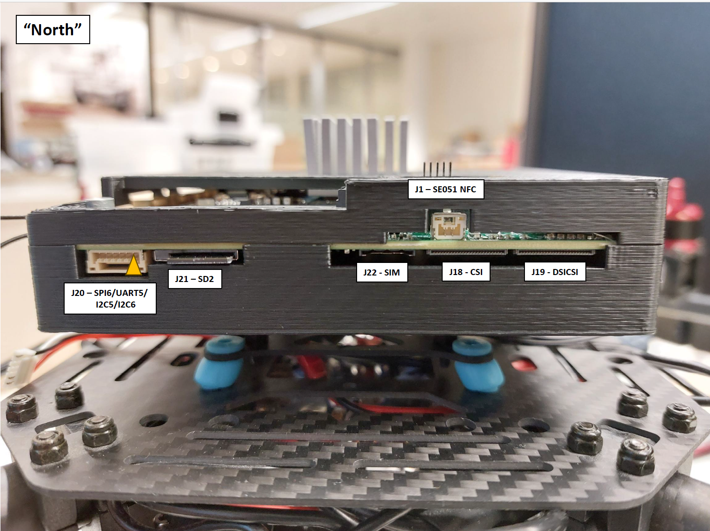
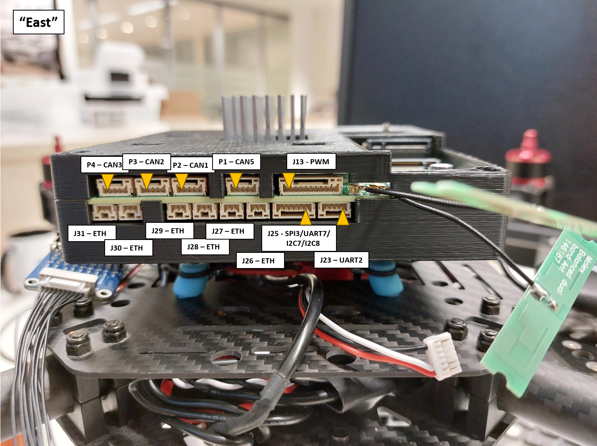
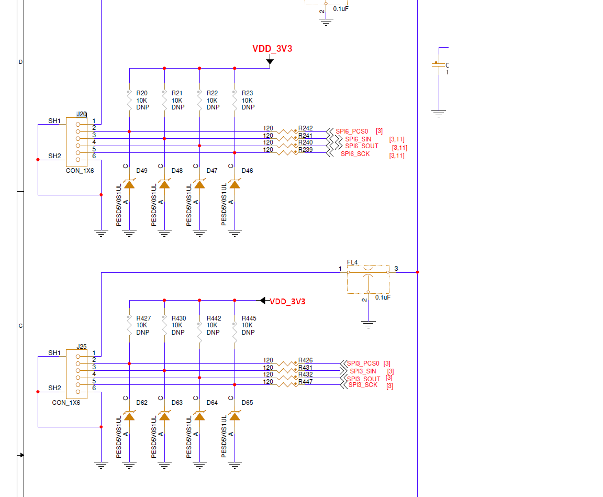
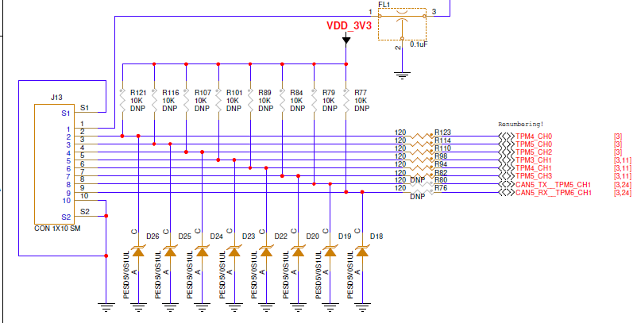
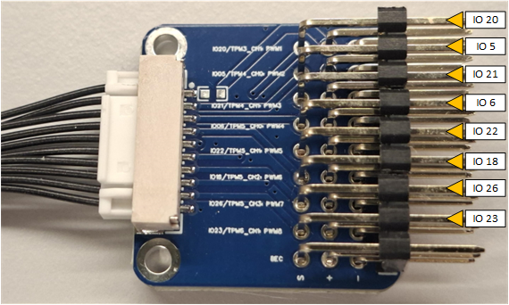
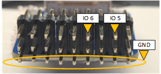
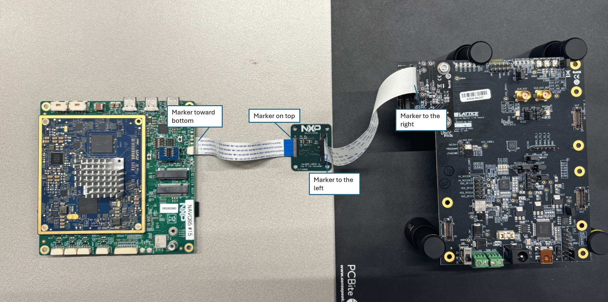

# Interfacing with Argos

Both [Build SD card image](../README.md#build-sd-card-image) and [Flash image to SD card](../README.md#flash-image-to-sd-card) are required to get the Navq95 interfacing with Argos.
[Flash NOR flash image](../README.md#flash-nor-flash-image) can be skipped.

Refer to [Power up Navq95](../README.md#power-up-navq95) for information on powering up the board, access tty's and login.

## Update linux kernel (Temporary)

Updating the linux kernel may be required if changes have not been fully merged that are applicable to interfacing with Argos.

Build kernel:
```bash
git clone git@github.com:NXPHoverGames/linux-imx-private.git -b imx95-navq-lf-6.12.y-argos-debug
cd linux-imx-private
make ARCH=arm64 CROSS_COMPILE=aarch64-linux-gnu- imx_v8_defconfig
make ARCH=arm64 CROSS_COMPILE=aarch64-linux-gnu- -j16
```

Copy build output to sdcard:
```bash
# Replace block device (/dev/sdx) and mountpoint (/mnt) with correct values for your host system.
sudo mount /dev/sdx2 /mnt
sudo make ARCH=arm64 CROSS_COMPILE=aarch64-linux-gnu- modules_install INSTALL_MOD_PATH=/mnt
sudo umount /mnt
sudo mount /dev/sdx1 /mnt
sudo cp ./arch/arm64/boot/Image ./arch/arm64/boot/dts/freescale/imx95-navq*.dtb /mnt
sudo umount /mnt
```

## Update devicetree

The default devicetree blob need to be adjusted to load the required SPI and GPIO drivers.

- Connect to the A55 tty debug port
- Power up NavQ95
- Hit button when u-boot displays: 'Hit any key to stop autoboot'
- Enter these commands on the u-boot prompt to change the device tree blob and make it persistent:
  ```console
  setenv fdtfile imx95-navqa-argos.dtb
  saveenv
  boot
  ```

## Test SPI & GPIO

Below are two python scripts who demonstrates the usage of GPIO and SPI.
These will send dummy SPI messages and toggle GPIO lines whose signals can be measured on a scope.

- create test_spi.py:
  ```python
  import spidev
  import time
  import sys

  bus = int(sys.argv[1])

  spi = spidev.SpiDev()
  spi.open(bus, 0) # chip select 0

  spi.max_speed_hz = 500000
  spi.mode = 0

  while True:
      spi.xfer2([0xaa])
      time.sleep(0.5)
  ```

- create test_gpio.py:
  ```python
  import gpiod
  import time
  import sys

  io_pin = int(sys.argv[1])

  chip = gpiod.Chip('gpio_gpio2')
  line = chip.get_line(io_pin)
  line.request(consumer='my-app', type=gpiod.LINE_REQ_DIR_OUT)

  while True:
      line.set_value(0)
      time.sleep(0.5)
      line.set_value(1)
      time.sleep(0.5)
  ```

- Run below commands to verify the interfaces using a oscilloscope
  ```bash
  # test SPI on J25
  python test_spi.py 0

  # test SPI on J20
  python test_spi.py 1

  # test GPIO on J13 pin 2 (IO5/TPM4_CH0)
  python test_gpio.py 5

  # test GPIO on J13 pin 3 (IO6/TPM5_CH0)
  python test_gpio.py 6
  ```

See images below to find correct ports and pins. Yellow arrow points to pin 1.






In case the pwm adapter board is being used to access the GPIO pins then refer to below images to find correct pins.




## Connect Lattice board

The Lattice board emulates the Argos and generates a saw-tooth csi frame. The following sequence will stream this frame into a file. Make sure the Lattice is connected to the iMX95 correctly. NOTE: The flat-foils have blue markers, keep those oriented as shown in the pictures.



Enter the commands below in the linux console to configure the pipeline:
```bash
 media-ctl -l "'dummy_csi2_sensor':0->'csidev-4ad30000.csi':0 [1]"
 media-ctl -l "'csidev-4ad30000.csi':1 -> '4ac10000.syscon:formatter@20':0 [1]"
 media-ctl -V "'dummy_csi2_sensor':0 [fmt: Y8_1X8/960x32 field:none]"
 media-ctl -V "'csidev-4ad30000.csi':0 [fmt: Y8_1X8/960x32 field:none]"
 media-ctl -V "'4ac10000.syscon:formatter@20':0 [fmt: Y8_1X8/960x32 field:none]"
 media-ctl -V "'crossbar':2 [fmt: Y8_1X8/960x32 field:none]"
 media-ctl -V "'mxc_isi.0':0 [fmt: Y8_1X8/960x32 field:none]"
 media-ctl -V "'mxc_isi.1':0 [fmt: Y8_1X8/960x32 field:none]"
 media-ctl -V "'mxc_isi.2':0 [fmt: Y8_1X8/960x32 field:none]"
 media-ctl -V "'mxc_isi.3':0 [fmt: Y8_1X8/960x32 field:none]"
 media-ctl -V "'mxc_isi.4':0 [fmt: Y8_1X8/960x32 field:none]"
 media-ctl -V "'mxc_isi.5':0 [fmt: Y8_1X8/960x32 field:none]"
 media-ctl -V "'mxc_isi.6':0 [fmt: Y8_1X8/960x32 field:none]"
 media-ctl -V "'mxc_isi.7':0 [fmt: Y8_1X8/960x32 field:none]"
```

Run command below to start capturing data into ```frame.raw```. Then press the SYS_RST button on the Lattice board to trigger data sending over CSI.
```bash
v4l2-ctl -d "/dev/video0" -v width=960,height=32,pixelformat=GREY --stream-mmap --stream-to=frame.raw --stream-count=1
```

The lattice board sends sequences of increasing values i.e. byte values from 0x0 to 0xff.
